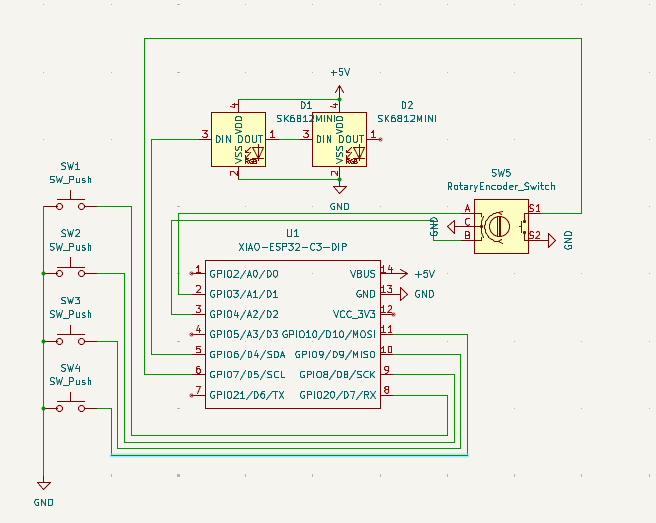

# MyMacropad
Hi This is my submission for Hackpad!  
This was made for Highway to Undercity.

## Features

- [x] 2x LEDS  
- [x] Rotary Encoder  
- [x] 4 keys
- [x] Hot swapable keys    
- [x] KMK firmware  

## PCB

Here are pictures of my PCB:

**Schematic**

**PCB**

**3D view**

- [x] I ran DRC and there are 0 errors ✅

## CAD

Designed using Onshape.  
Everything fits together with 4x M3 screws and nuts. I added holes for the leds.

## Firmware

Written in **Python** using **KMK**, so it’s easy to customize!  
You’ll find the code in the `main.py` file in this repo.

You can use this macropad to:
- Undo Redo 
- Volume controls 
- control pen and mouse on a whiteboard (depends on which ones but you can always change the keys)

## BOM

| Qty | Part |
|-----|------|
| 1x  | Seeeduino XIAO RP2040 |
| 4x | Cherry MX Switches |
| 2x  | SK6812-MINI-E LEDs |
| 4x  | M3 screws and matching nuts |
| 1x  | EC11 Rotary encoders |
